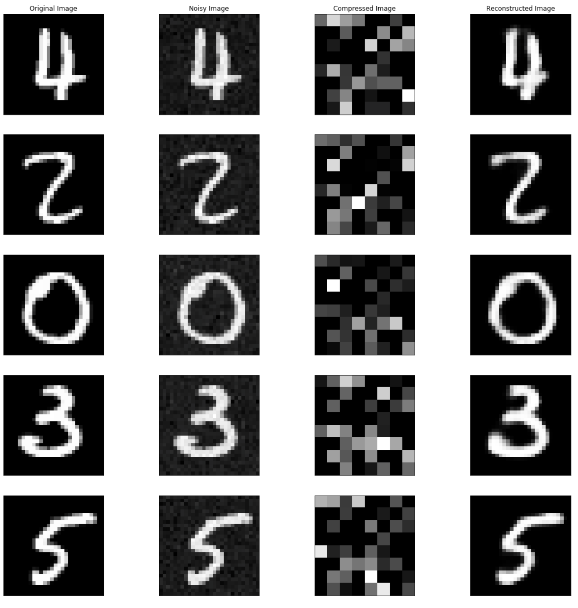

# deep-compression
Deep Compression utilizing denoising autoencoders

<p> Paper in reference: <a href="https://arxiv.org/pdf/1703.00395.pdf">Lossy Image Compression with Compressive Autoencoders</a>
  
## Autoencoder architecture


## Deep Compression - Deep Denoising Compressive Autoencoders (DCAE) - architecture


## Preliminary Results

#### This was generated using the following architecture (note lack of 'deep' and 'compressive') for 100 epochs
```python

DAE(
  (encoder): Sequential(
    (0): Linear(in_features=784, out_features=256, bias=True)
    (1): ReLU(inplace=True)
    (2): Linear(in_features=256, out_features=128, bias=True)
    (3): ReLU(inplace=True)
    (4): Linear(in_features=128, out_features=64, bias=True)
    (5): ReLU(inplace=True)
  )
  (decoder): Sequential(
    (0): Linear(in_features=64, out_features=128, bias=True)
    (1): ReLU(inplace=True)
    (2): Linear(in_features=128, out_features=256, bias=True)
    (3): ReLU(inplace=True)
    (4): Linear(in_features=256, out_features=784, bias=True)
    (5): Sigmoid()
  )
)

```


